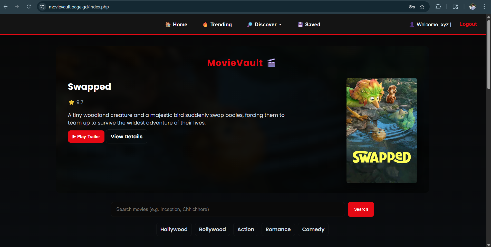
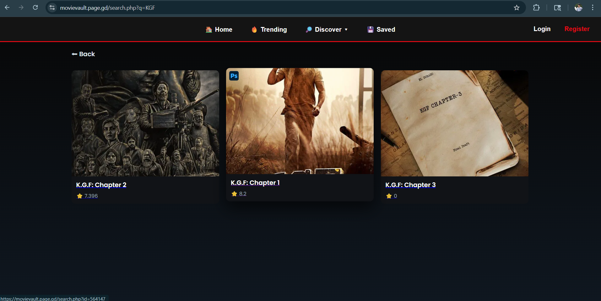
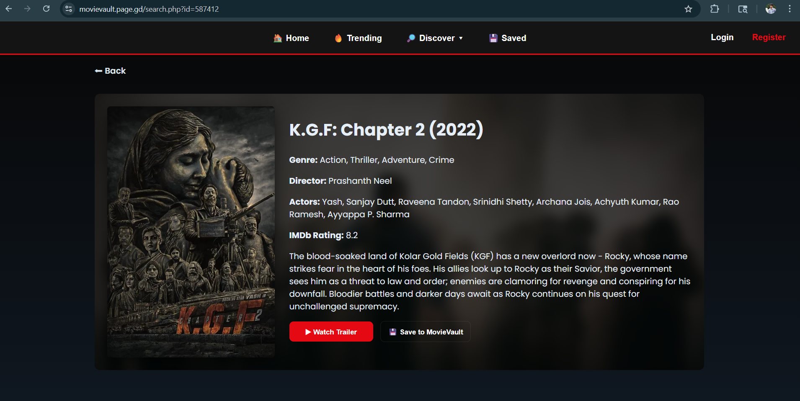
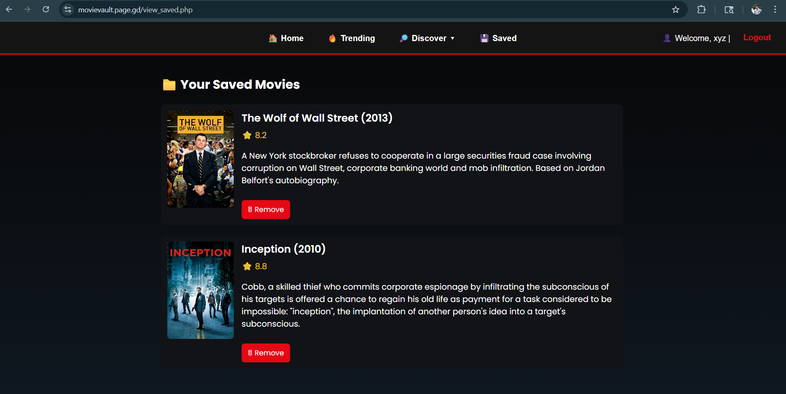
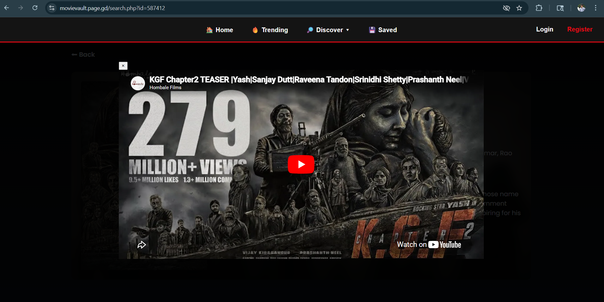

# 🎬 MovieVault

MovieVault is a movie discovery and management web application built using **PHP, MySQL, and TMDB API**.
It allows users to search movies, explore categories, and save their favorite movies.

---

## 🚀 Features

* 🔍 **Smart Movie Search**

  * Handles short queries like *KGF, RRR, PK*
  * Intelligent filtering and ranking
  * Multiple fallback search logic

* 🎥 **Movie Details Page**

  * Poster, genre, cast, director
  * IMDb rating integration
  * Trailer support (YouTube)

* 🧠 **Advanced Search Logic**

  * Handles special characters (K.G.F → KGF)
  * Exact match boosting
  * Multi-word relevance scoring

* 💾 **Save Movies**

  * Save favorite movies to database
  * View saved list anytime

* 🔥 **Discover Section**

  * Hollywood / Bollywood / Genre-based browsing

* ⚡ **Performance Optimization**

  * IMDb rating caching (reduces API calls)

---

## 🛠️ Tech Stack

* **Frontend:** HTML, CSS
* **Backend:** PHP
* **Database:** MySQL
* **APIs Used:**

  * TMDB API
  * OMDB API

---

## 📸 Screenshots

### 🏠 Home Page


### 🔍 Search Page


### 🎬 Movie Details Page


### 💾 Saved Movies


### ▶️ Trailer Feature


---

## ⚙️ Installation (Local Setup)

1. Clone the repository:

```bash
git clone https://github.com/YOUR_USERNAME/movievault.git
```

2. Move project to XAMPP:

```
htdocs/movievault
```

3. Create MySQL database:

```
movievault
```

4. Create required tables (users, movie_cache, saved movies)

5. Configure `config.php`:

```php
$servername = "localhost";
$username   = "root";
$password   = "";
$database   = "movievault";
```

6. Add your API keys:

```php
$TMDB_KEY = "YOUR_TMDB_KEY";
$OMDB_KEY = "YOUR_OMDB_KEY";
```

7. Start XAMPP (Apache + MySQL)

8. Open in browser:

```
http://localhost/movievault
```

---

## 🔐 Important Note

API keys and database credentials are **not included** in this repository for security reasons.

---

## 🌐 Live Demo

🔗 https://movievault.page.gd

---

## 📌 Future Improvements

* 🎯 Auto-suggestions while typing
* 🎬 Recommendation system
* 👤 User profiles
* 📱 Better mobile responsiveness

---

## 🙌 Author

Developed by **Raghav Marda**

---

## ⭐ If you like this project

Give it a ⭐ on GitHub!
